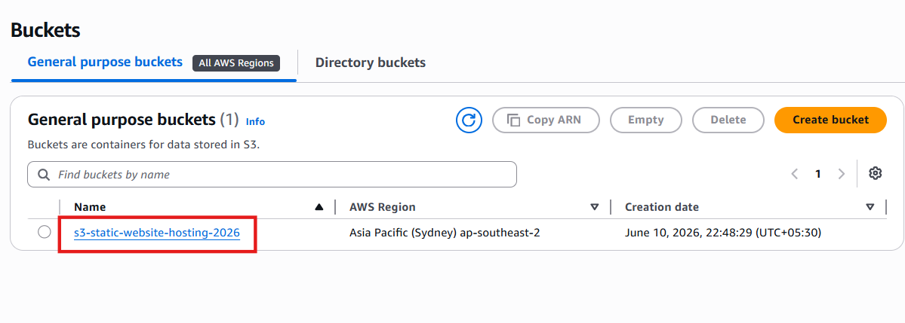
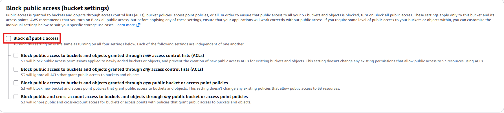
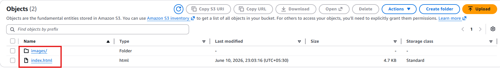
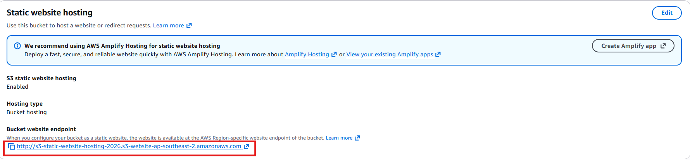
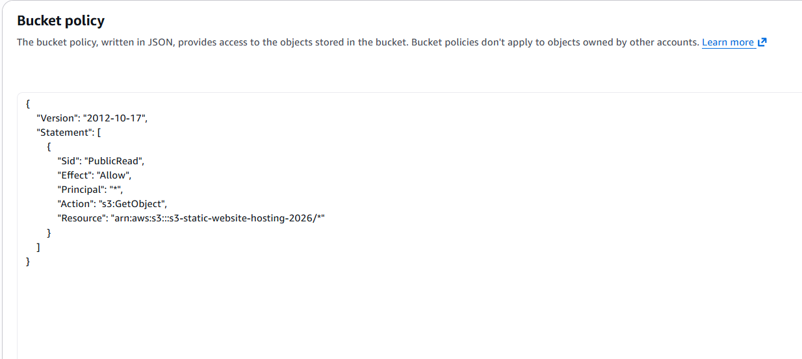
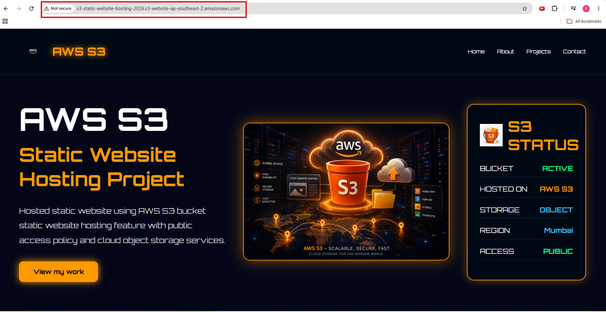

# AWS S3 Static Website Hosting Project

## Objective

Host a static HTML website using AWS S3 Static Website Hosting.

---

## Services Used

- AWS S3
- Static Website Hosting
- Bucket Policy
- Public Access Settings

---

## Step 1 - Create S3 Bucket

Create S3 bucket from AWS Console.

---

## Step 2 - Disable Block Public Access

Disable Block Public Access settings.

---

## Step 3 - Upload Website Files

Upload HTML, CSS and image files to S3 bucket.

---

## Step 4 - Enable Static Website Hosting

Enable Static Website Hosting from Properties tab.

---

## Step 5 - Configure Bucket Policy

Add bucket policy to allow public read access.

---

## Step 6 - Access Website

Copy Website Endpoint URL and open it in browser.

---

# Final Result

Website successfully hosted on AWS S3.
